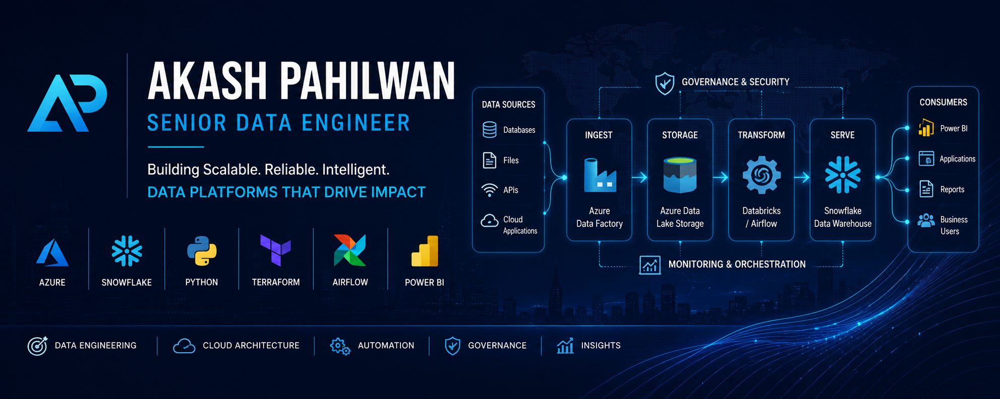
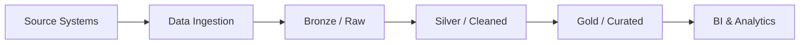
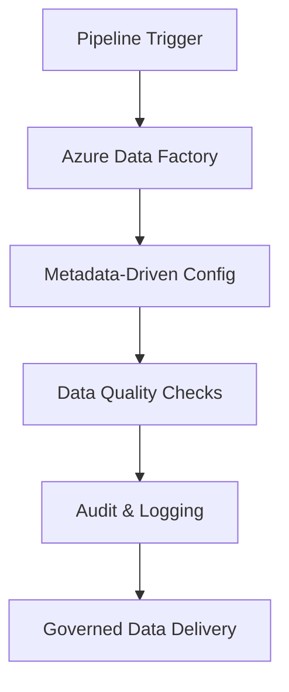
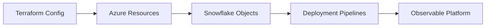

<!-- ========================= Banner ========================= -->

  

<h1 align="center">Hi 👋, I'm Akash Pahilwan</h1>

<h3 align="center">
Senior Data Engineer • Azure • Snowflake • Databricks • Datawarehouse • Python • Terraform
</h3>

Building scalable, governed, and automation-first data platforms that turn complex data into reliable business insight.

  
  
  

---

## 🛠 Technology Stack

  
  
  
  
  
  
  
  

---

## 📈 GitHub Analytics

  
  

  

---

## 👨‍💻 About Me

I'm a Senior Data Engineer focused on designing modern, cloud-native data platforms that are reliable, scalable, and easy to operate.

My work spans enterprise-grade ETL/ELT pipelines, data warehousing, orchestration, governance, and infrastructure automation across Azure, Snowflake, Databricks, DataRewarehouse, Python, and Terraform. I enjoy solving complex engineering problems with a strong balance of technical depth, platform thinking, and business value.

---

## 🚀 What I Do

- ☁️ Design and optimize cloud-native data platforms on Azure and modern data warehouses
- ❄️ Build scalable Snowflake and Databricks-based data models, pipelines, and transformations
- 🔄 Create metadata-driven ETL/ELT frameworks in Azure Data Factory and related orchestration layers
- 🧠 Implement configurable, reusable processing logic driven by metadata for scalable pipeline execution
- ⚙️ Implement Infrastructure as Code and automation using Terraform and Python
- 📊 Deliver analytics-ready datasets, governed data products, and reliable reporting enablement
- 🧭 Bridge engineering execution with platform strategy, performance, and business impact

---

## 🔧 Featured Projects

  
  

---

## 🏗 Architecture Gallery

A quick look at the kind of cloud-native data architecture patterns I work with.

### 1. Modern Data Platform

### 2. Orchestration and Governance

### 3. Infrastructure Automation

---

## 🌱 Currently Exploring

- Microsoft Fabric
- Apache Iceberg
- dbt
- Kubernetes
- Data Mesh
- Open Table Formats

---

## 🤝 Connect

- 🌐 Portfolio: https://akash-pahilwan-portfolio.netlify.app/
- 💼 LinkedIn: https://www.linkedin.com/in/akashpahilwan53
- 📧 Email: akashpahilwan53@gmail.com

---

## 💡 Professional Summary

I’m passionate about building data platforms that are scalable, maintainable, and production-ready. My goal is to combine strong engineering discipline with thoughtful architecture, automation, and governance to help teams move faster and make better decisions with data.

---

⭐ Thanks for visiting my profile!
