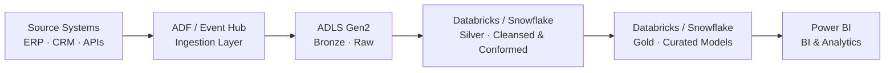
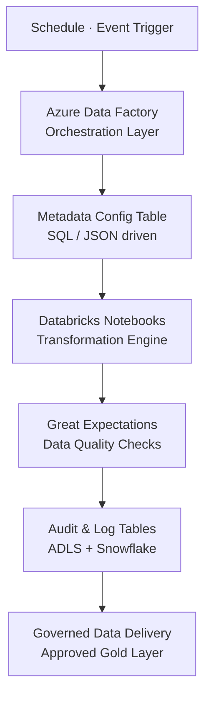
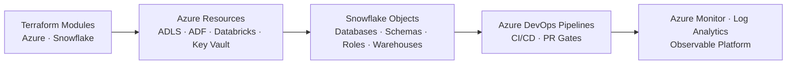

<!-- ========================= Banner ========================= -->

  

<h1 align="center">Hi 👋, I'm Akash Pahilwan</h1>

<h3 align="center">
Platform Engineer · Data Engineer • Azure • Snowflake • Databricks • DBT • Terraform
</h3>

Building scalable, governed, and automation-first data platforms that turn complex data into reliable business insight.

  
  
  

---

## 🛠 Technology Stack

  
  
  
  
  
  
  
  

---

## 👨‍💻 About Me

Platform & Data Engineer with 6+ years building large-scale pipelines and cloud-native data infrastructure across Snowflake, Azure (ADF, Databricks, ADLS Gen2), DBT, and Terraform.

At SkyZone I cut deployment time by **45%** through Terraform-driven CI/CD, reduced ADF pipeline runtime by **25%** by migrating to a metadata-driven architecture, and engineered a Python pipeline that parsed and migrated **60M+ records** for compliance. At Cervello I led a Redshift-to-Snowflake migration using DBT and boosted ETL efficiency by **~35%** through systematic optimization across ADF and Snowflake.

I work across the full data platform stack — pipelines, warehousing, IaC, governance, and data quality — with a focus on making platforms measurably faster, safer, and easier to operate.

---

## 🚀 What I Do

- ☁️ Design and optimize cloud-native data platforms on Azure and modern data warehouses
- ❄️ Build scalable Snowflake and Databricks-based data models, pipelines, and transformations
- 🔄 Create metadata-driven ETL/ELT frameworks in Azure Data Factory and related orchestration layers
- 🧠 Implement configurable, reusable processing logic driven by metadata for scalable pipeline execution
- ⚙️ Implement Infrastructure as Code and automation using Terraform and Python
- 📊 Deliver analytics-ready datasets, governed data products, and reliable reporting enablement
- 🧭 Bridge engineering execution with platform strategy, performance, and business impact

---

## 🏗 Architecture Gallery

A quick look at the kind of cloud-native data architecture patterns I work with.

### 1. Modern Data Platform — Medallion Architecture

### 2. Metadata-Driven Orchestration & Governance

### 3. Infrastructure Automation — IaC to Observability

---

## 🏅 Certifications

  
  
  

---

## 🌱 Currently Exploring

- Microsoft Fabric
- Apache Iceberg
- Data Mesh
- Open Table Formats (Apache Iceberg, Delta, Hudi)
- Kubernetes for data workloads

---

## 🤝 Connect

- 🌐 Portfolio: https://akash-pahilwan-portfolio.netlify.app/
- 💼 LinkedIn: https://www.linkedin.com/in/akashpahilwan53
- 📧 Email: akashpahilwan53@gmail.com

---

⭐ Thanks for visiting my profile!
